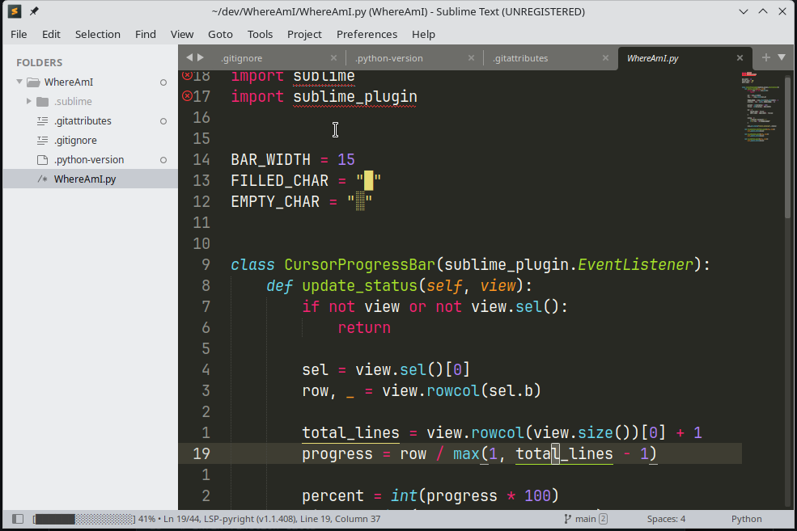

# WhereAmI

Tiny status bar indicator that shows you **exactly where you are** in the file.

Shows a small progress bar + percentage + current/total line numbers.

Because sometimes you just need to know… *where the hell am I?* 😅

### Features
- Live updating progress bar (█▓░ style)
- Shows current line / total lines
- Percentage complete
- Updates on cursor movement, tab switch & file edits
- Zero configuration – just works
- Extremely lightweight

### Preview

### Installation
Package Control → Install Package → **WhereAmI**

(or just search for "WhereAmI")

Enjoy never getting lost in a 10,000-line file again! 🚀